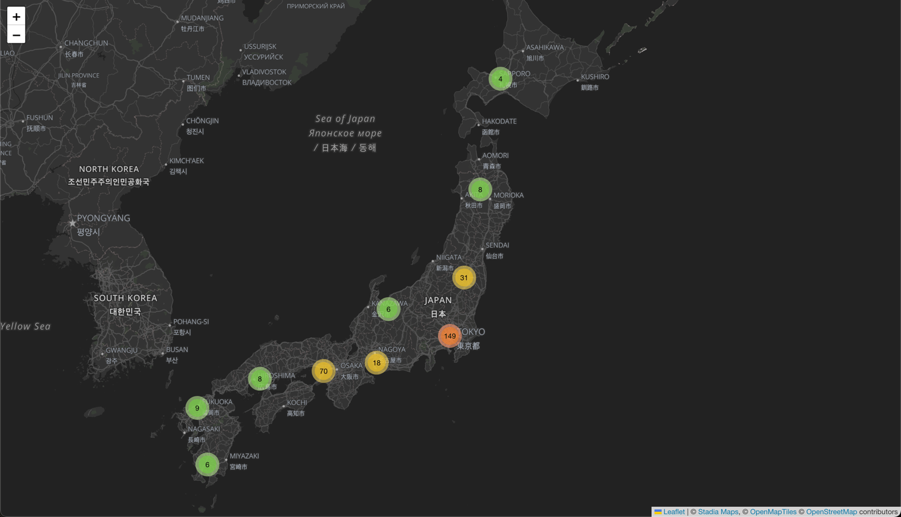

# Getting Started with React Leaflet and MapLibre

This project will get you started using [Stadia Maps](https://stadiamaps.com/) in your React application using
[React Leaflet](https://react-leaflet.js.org/), the
[MapLibre GL Leaflet](https://github.com/maplibre/maplibre-gl-leaflet) plugin for vector
tile support, and [react-leaflet-cluster](https://github.com/akursat/react-leaflet-cluster)
for marker clustering.

## Quickstart

No magic here; just your usual npm sequence:

```shell
npm install
npm start
```

Your browser should open automatically, showing a map of all video arcades in Japan, using OpenStreetMap
data fetched using [Overpass Turbo](https://overpass-turbo.eu/s/1r4V) on Feb 7, 2023.

