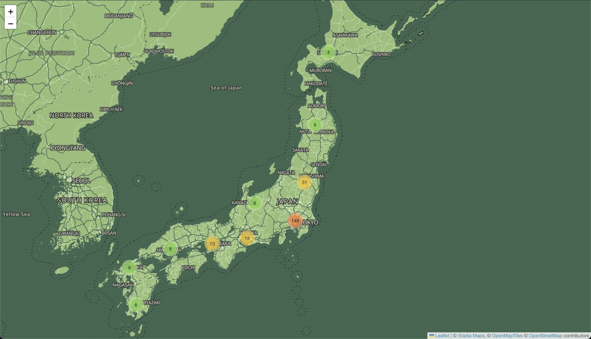

# Getting Started with React Leaflet and MapLibre

This project will get you started using [Stadia Maps](https://stadiamaps.com/) in your React application using
[React Leaflet](https://react-leaflet.js.org/) and [react-leaflet-cluster](https://github.com/akursat/react-leaflet-cluster)
for marker clustering.

## Quickstart

No magic here; just your usual npm sequence:

```shell
npm install
npm start
```

Your browser should open automatically, showing a map of all video arcades in Japan, using OpenStreetMap
data fetched using [this Overpass Turbo query](https://overpass-turbo.eu/s/1r4V) on Feb 7, 2023.

## Vector support

The default configuration loads raster tiles, but [AppVector.js](src/AppVector.js)
provides a vector example using the [MapLibre GL Leaflet](https://github.com/maplibre/maplibre-gl-leaflet)
plugin. You can control which tiles are loaded with the `useVector` flag in [index.js](src/index.js).


